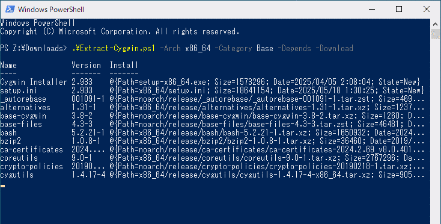
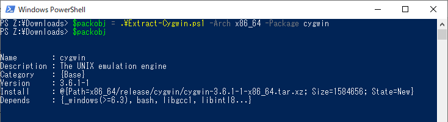
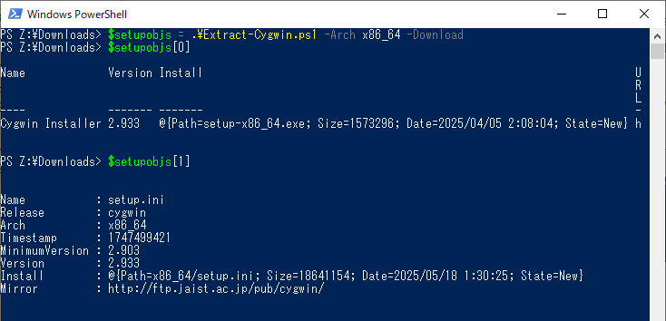

extract-cygwin
===============

Cygwin installer displays the name, version, and description of packages on
the wizard, reading those information from `setup.ini`, and can download
packages for your sellection from the mirror site.

This script will extract the information of Cygwin packages from `setup.ini`
and download that package's file to the local installation directory,
which works with Powershell 2.0 and later.

Currently, Windows 2000, XP, Vista, or 7 is unsupported by Cygwin Project but
the [Cygwin Time Machine](
http://www.crouchingtigerhiddenfruitbat.org/Cygwin/timemachine.html) provides
the archive of Cygwin packages. This script can download easily the last
version supporting older Windows from that site with `-TimeMachine`.

## Usage

The package information of which target names are specified with `-Package`,
`-PackageSet`, and/or `-Category` is extracted, led by `x86` or `x86_64` for
32-bit or 64-bit architecture. In addition to that, the information of packages
needed by others is extracted with `-Depends` or `-Requires`.

To extract the information of 32-bit cygwin and git package:

    .\Extract-Cygwin.ps1 x86 -Package cygwin, git

With `-Download`, the package's file in the directory described on that
information is downloaded to the local from the mirror site of URL specified
with `-Mirror` or the country of the cuurent region if present.

Run the command as below image if you wish to use 64-bit packages of `Base`
category, download that files to the local dilectory, and install it by Cygwin
insaller:

To display the detailed information about this script:

    man .\Extract-Cygwin.ps1 -Detailed

## Feature

This script outputs an information object for each package extracted from
setup.ini. It's displayed to standard output unless received by a variable or
pipeline.

The details of setup.ini is defined by [setup.ini documentation](
https://sourceware.org/cygwin-apps/setup.ini.html). Those informations are
storing to a custoum object, that structure and members are as follows.

- Name [String]: package name
- Description [String]: short description
- LongDescription [String]: long description, outputs if specified by
                            `-Supplement`
- Category [Object[]]: category names
- Version [String]: package version
- ReplaceVersions [Object[]]: withdrawn versions (Optional)
- Install [Object]: binary package information, outputs if package or set name
                    is specified by `-Package` or `-PackageSet`, or a category
                    name is specified by `-Category`, or binary package is
                    needed at runtime or to build the source for others
  - Path [String]: binary package file's path relative to mirror directory
  - Size [long]: binary package file's size
  - Hash [String]: hash value for binary package file, outputs if specified by
                   `-Supplement`
  - Date [DateTime]: binary package file's date, outputs with `-Download`
  - State [String]: "New", "Unchagned", or "Older" for installed binary
                    specified by `-Local`
- Source [Object]: source package information, outputs if package name is
                   specified by `-Source`
  - Path [String]: source package file's path relative to mirror directory
  - Size [long]: source package file's size
  - Hash [String]: hash value for source package file, outputs if specified by
                   `-Supplement`
  - Date [DateTime]: source package file's date, outputs with `-Download`
  - State [String]: "New", "Unchagned", or "Older" for installed source
                    specified by `-Local`
- Depends [Object[]]: necessary package names at runtime
- Conflicts [Object[]]: conflicted packages (Optional), outputs if specified
                        by `-Supplement`
- Obsoletes [Object[]]: obsoleted packages (Optional), outputs if specified by
                        `-Supplement`
- Provides [Object[]]: provided packages (Optional)
- BuildDepends [Object[]]: necessary package names to build the source
                           (Optional), outputs if package name is specified by
                           `-Source`

About the information of Cygwin installer and setup.ini output with
`-Download`, please see below.

- Name [String]: "Cygwin Installer" or "setup.ini"
- Release [String]: "cygwin" (Only setup.ini)
- Arch [String]: "x86" or "x86_64" (Only setup.ini)
- Timestamp [long]: unix time at which download file is created (Only setup.ini)
- MinimumVersion [String]: necessary setup version (Only setup.ini)
- Version [String]: setup version
- Install [Object]:
  - Path [String]: download file's path relative to mirror directory
  - Size [long]: dowanload file's size
  - Date [DateTime]: download file's date
  - State [String]: "New", "Unchagned", or "Older" for already downloaded file
- URL [String]: download URL (Only Cygwin installer)
- Mirror [String]: mirror site to download setup.ini and packages (Only setup.ini)

## Note

Run the following line if any scripts can not be executed on your system:

    Set-ExecutionPolicy RemoteSigned -Scope Process

## License

This script is published under the MIT License.
